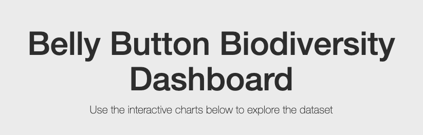
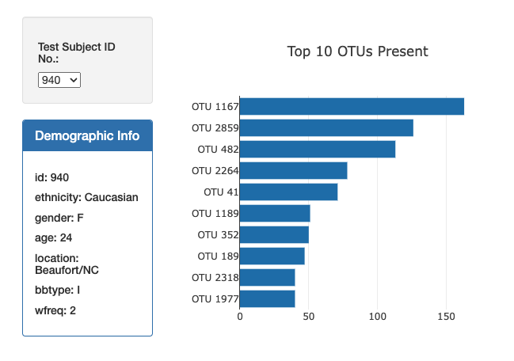
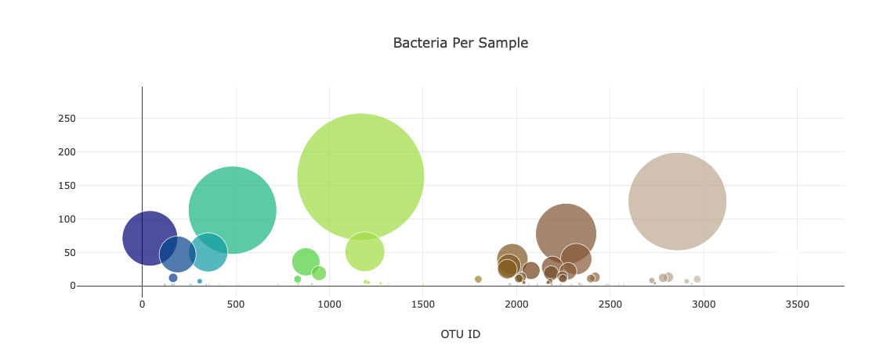

# belly-button-challenge

#### An Interactive dashboard was built to explore the belly button biodiversity dataset which catalogs the microbes that colonize human navels. 

#### The dataset reveals that a small handful of microbial species (also called operational taxonomic units, or OTUs, in the study) were present in more than 70% of people, while the rest were relatively rare.

#### Used the D3 library to read in samples.json from URL https://2u-data-curriculum-team.s3.amazonaws.com/dataviz-classroom/v1.1/14-Interactive-Web-Visualizations/02-Homework/samples.json. 

#### The dashboard will contain a horizontal bar chart with a dropdown menu to display the to 10 OTUs found in each individual.   It will also contain a bubble chart that will display each sample. 

